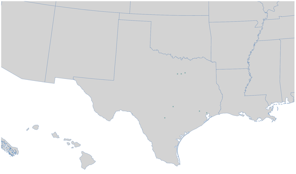
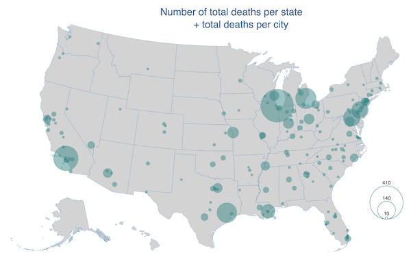
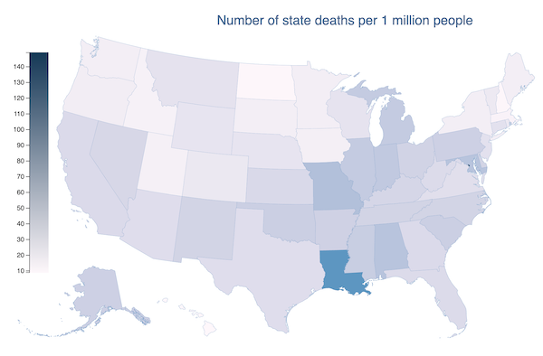
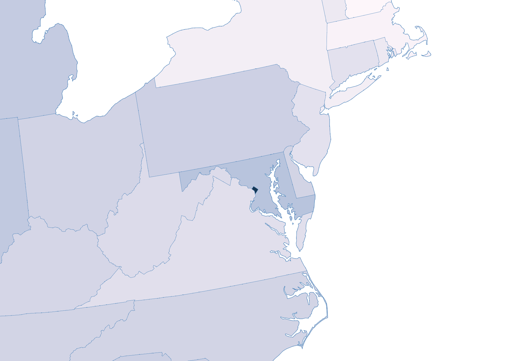

# Project 3

The goal of this project is to build a complete web-based visualization system leveraging outcomes from the previous two projects by using JavaScript and D3 to visualize and interactively analyze a dataset. For a 5-minute presentation, please watch the video below:

### Description:

- This visualization refers to statistics collected by [Slate](http://www.slate.com/articles/news_and_politics/crime/2012/12/gun_death_tally_every_american_gun_death_since_newtown_sandy_hook_shooting.html) for deaths caused by gun use between 2012 and 2013.

- The spreadsheet offered by Slate was processed using Pandas and Jupyter notebooks to produce the two JSON files used on this website for city and state death frequencies.

### Challenges:

One of the challenges I faced is finding a good balance between how cities look in zoomed views for very small states vs very large states. For example, here is how small cities look in the case of Texas: 

and here is how Washington, DC looks like:

Another challenge was about finding a good balance of content displayed by the bubble map. I found that only showing the top 181 cities with highest number of deaths is a good balance and does not overcrowd the map:

Finally, in the choropleth map the challenge was to make the state with the highest number of deaths per 1 million visible enough, considering the small size of the state. While the 2nd state in this ranking, Lousiana, is very visible:

DC is barely visible:

### Data questions

A few interesting questions about this dataset that we could try answering with this visualization are:

- When lookings at the number of deaths for any state, is it possible to also see deaths in the major cities belonging to that same state in the same view, without navigating away from the state view?

- How are cities with the largest number of deaths spread out throughout the US map? Are they in all parts of the US, or concentrated on one of the coasts? Or rather north vs south of US?

- When looking at the number of deaths in any particular city, can we visualize a breakdown based on the victim gender? What about the victim's average age?

### How to use the visualization:

- In the initial map view, you can hover over states to see the total number of deaths per state broken down by gender. You can click any state to zoom in and see the top 7 cities in the state with the highest number of deaths. Clicking another neighboring state lets you move to that state, while clicking the same state lets you zoom out.

- The "Show city data" toggle lets you view a bubble map with the top 181 cities of the country with most deaths and a bubble legend with min/mid/max values. Hovering over a city will show the number of deaths in this city.

- The "Show state data" toggle lets you view a choropleth map with number of deaths normalized to a million people. You can also add the bubble map on top.

Here the [SGD visualization](https://mhorga.github.io/project3/) available for exploration.
